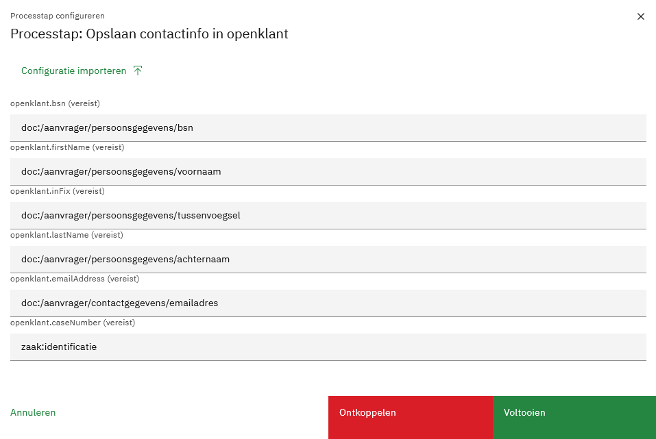
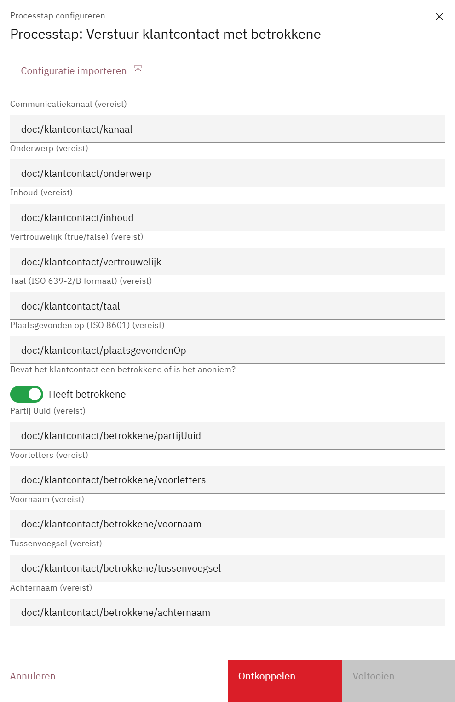
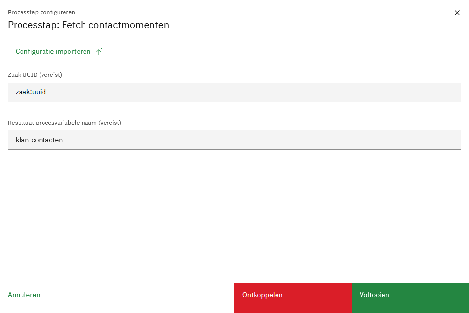

# OpenKlant

## Omschrijving

De OpenKlant plug-in verzorgt:

- Plug-in acties:
    - Het opslaan van partij op basis van voor- en achternaam, e-mailadres, bsn en zaaknummer.
    - Het ophalen van klantcontacten
- Value resolver:
    - `klant:klantcontacten`
    - `klant:klantcontactenOrNull`
- Custom tabblad component:
    - Het tonen van klantcontacten

Het communiceert met een OpenKlant (v2) implementatie.

## Documentatie

### Plug-in properties:

* OpenKlant klantinteracties URL (_bv. https://openklant.gemeente.nl/klantinteracties/api/v1/_)

* OpenKlant Token

Een algemene beschrijving van het configureren van plug-ins vind je
hier:[https://docs.valtimo.nl/features/plugins#configuring-plugins](https://docs.valtimo.nl/features/plugins#configuring-plugins)

Voorbeeld `*.pluginconfig.json`:

```json   
{
  "id": "12023724-a4bd-431d-93c0-5ba52049e9cd",
  "title": "OpenKlant (Autodeployed)",
  "pluginDefinitionKey": "openklant",
  "properties": {
    "klantinteractiesUrl": "${AUTODEPLOYMENT_PLUGINCONFIG_OPENKLANT_KLANTINTERACTIES_URL}",
    "token": "${AUTODEPLOYMENT_PLUGINCONFIG_OPENKLANT_AUTHORIZATION_TOKEN}"
  }
}   
```

Voorbeeld `.env.properties`:

```properties
AUTODEPLOYMENT_PLUGINCONFIG_OPENKLANT_KLANTINTERACTIES_URL=https://openklant.gemeente.nl/klantinteracties/api/v1/
AUTODEPLOYMENT_PLUGINCONFIG_OPENKLANT_AUTHORIZATION_TOKEN=AAAAAAAAAAAAAAAAAA
```

### Opslaan partij:



Voorbeeld `*.processlink.json`:

```json
{
  "activityId": "Activity_OpslaanPartij",
  "activityType": "bpmn:ServiceTask:start",
  "pluginConfigurationId": "12023724-a4bd-431d-93c0-5ba52049e9cd",
  "pluginActionDefinitionKey": "store-contactinfo",
  "actionProperties": {
    "bsn": "doc:/persoonsgegevens/bsn",
    "firstName": "doc:/persoonsgegevens/voornaam",
    "inFix": "doc:/persoonsgegevens/tussenvoegsel",
    "lastName": "doc:/persoonsgegevens/achternaam",
    "emailAddress": "doc:/contactgegevens/emailadres",
    "caseNumber": "zaak:identificatie"
  },
  "processLinkType": "plugin"
}
```

### Versturen van klantcontact


Voorbeeld `*.processlink.json`
```json
{
  "activityId": "verstuurKlantcontact",
  "activityType": "bpmn:ServiceTask:start",
  "pluginConfigurationId": "12023724-a4bd-431d-93c0-5ba52049e9cd",
  "pluginActionDefinitionKey": "register-klantcontact",
  "actionProperties": {
    "hasBetrokkene": true,
    "kanaal": "doc:/klantcontact/kanaal",
    "onderwerp": "doc:/klantcontact/onderwerp",
    "inhoud": "doc:/klantcontact/inhoud",
    "vertrouwelijk": "doc:/klantcontact/vertrouwelijk",
    "taal": "doc:/klantcontact/taal",
    "plaatsgevondenOp": "doc:/klantcontact/plaatsgevondenOp",
    "partijUuid": "doc:/klantcontact/betrokkene/partijUuid",
    "voorletters": "doc:/klantcontact/betrokkene/voorletters",
    "voornaam": "doc:/klantcontact/betrokkene/voornaam",
    "voorvoegselAchternaam": "doc:/klantcontact/betrokkene/voorvoegselAchternaam",
    "achternaam": "doc:/klantcontact/betrokkene/achternaam"
  },
  "processLinkType": "plugin"
}
```

zonder betrokkene:
```json
{
  "activityId": "verstuurKlantcontactZonderBetrokkene",
  "activityType": "bpmn:ServiceTask:start",
  "pluginConfigurationId": "12023724-a4bd-431d-93c0-5ba52049e9cd",
  "pluginActionDefinitionKey": "register-klantcontact",
  "actionProperties": {
    "hasBetrokkene": false,
    "kanaal": "doc:/klantcontact/kanaal",
    "onderwerp": "doc:/klantcontact/onderwerp",
    "inhoud": "doc:/klantcontact/inhoud",
    "vertrouwelijk": "doc:/klantcontact/vertrouwelijk",
    "taal": "doc:/klantcontact/taal",
    "plaatsgevondenOp": "doc:/klantcontact/plaatsgevondenOp"
  },
  "processLinkType": "plugin"
}
```

### Ophalen klantcontacten (actie):



Voorbeeld `*.processlink.json`:

```json
{
  "activityId": "Activity_OphalenKlantcontacten",
  "activityType": "bpmn:ServiceTask:start",
  "pluginConfigurationId": "12023724-a4bd-431d-93c0-5ba52049",
  "pluginActionDefinitionKey": "get-contact-moments-by-case",
  "actionProperties": {
    "objectUuid": "zaak:uuid",
    "resultPvName": "klantcontacten"
  },
  "processLinkType": "plugin"
}
```

### Ophalen klantcontacten (value resolver):

Benodigde configuratie in `.env.properties`:

```properties
AUTODEPLOYMENT_PLUGINCONFIG_OPENKLANT_KLANTINTERACTIES_URL=https://openklant.gemeente.nl/klantinteracties/api/v1/  
AUTODEPLOYMENT_PLUGINCONFIG_OPENKLANT_AUTHORIZATION_TOKEN=
```

Tonen klantcontacten:

Benodigde dossier properties:

```json
{
  ...
  "properties": {
    ...
    "klantcontacten": {
      "type": "array",
      "items": {
        "properties": {
          "plaatsgevondenOp": {
            "type": "string"
          },
          "indicatieContactGelukt": {
            "type": "string"
          }
        }
      },
      "default": []
    },
    ...
  }
```

LET OP: het klantcontacten property moet bereikbaar zijn via `doc:/klantcontacten` om het tab te kunnen laten
werken.

### Frontend

In de frontend moet de volgende waarden toegevoegd worden:

```typescript
@NgModule({
    declarations: [AppComponent,],
    imports: [
        //...
        OpenKlantPluginModule,
    ],
    providers: [
        {
            provide: PLUGINS_TOKEN, useValue: [
                //...
                openKlantPluginSpecification,],
        },
        {
            provide: CASE_TAB_TOKEN,
            useValue: {
                'klantcontact-tab': KlantcontactTabComponent, // voeg deze alleen toe als je het klantcontacten tab wilt gebruiken.
            }
        }
    ],
    //...
})
```

Zie [toevoegen van plugins](https://docs.valtimo.nl/features/plugins/plugins/custom-plugin-definition#adding-the-plugin-module-to-the-ngmodule)
en [toevoegen van case tabs](https://docs.valtimo.nl/features/case/for-developers/case-tabs)
in de Valtimo docs.