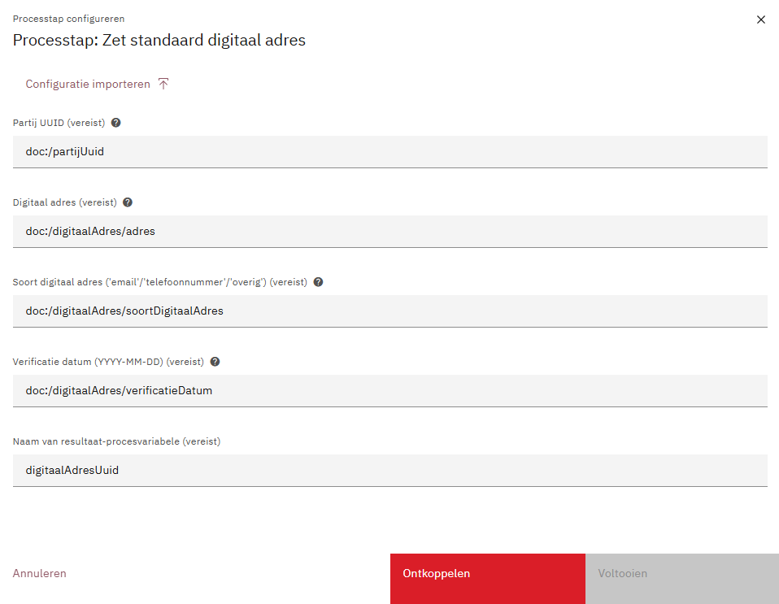

# Open Klant

## Omschrijving

De Open Klant plug-in verzorgt:

- Plug-in acties:
    - Het opslaan van partij op basis van voor- en achternaam, e-mailadres, bsn en zaaknummer.
    - Het ophalen van klantcontacten
- Value resolver:
    - `klant:klantcontacten`
    - `klant:klantcontactenOrNull`
- Custom tabblad component:
    - Het tonen van klantcontacten

Het communiceert met een Open Klant (v2) implementatie.

## Plug-in properties:

* Open Klant klantinteracties URL (_bv. https://openklant.gemeente.nl/klantinteracties/api/v1/_)

* Open Klant Token

Een algemene beschrijving van het configureren van plug-ins vind je
hier:[https://docs.valtimo.nl/features/plugins#configuring-plugins](https://docs.valtimo.nl/features/plugins#configuring-plugins)

Voorbeeld `*.pluginconfig.json`:

```json   
{
  "id": "12023724-a4bd-431d-93c0-5ba52049e9cd",
  "title": "Open Klant",
  "pluginDefinitionKey": "openklant",
  "properties": {
    "klantinteractiesUrl": "${AUTODEPLOYMENT_PLUGINCONFIG_OPENKLANT_KLANTINTERACTIES_URL}",
    "token": "${AUTODEPLOYMENT_PLUGINCONFIG_OPENKLANT_AUTHORIZATION_TOKEN}"
  }
}   
```

Voorbeeld `.env.properties`:

```properties
AUTODEPLOYMENT_PLUGINCONFIG_OPENKLANT_KLANTINTERACTIES_URL=https://openklant.gemeente.nl/klantinteracties/api/v1/
AUTODEPLOYMENT_PLUGINCONFIG_OPENKLANT_AUTHORIZATION_TOKEN=AAAAAAAAAAAAAAAAAA
```

## Opslaan partij:


Voorbeeld `*.processlink.json`:

```json
{
  "activityId": "Activity_OpslaanPartij",
  "activityType": "bpmn:ServiceTask:start",
  "pluginConfigurationId": "12023724-a4bd-431d-93c0-5ba52049e9cd",
  "pluginActionDefinitionKey": "store-contact-info",
  "actionProperties": {
    "bsn": "doc:/persoonsgegevens/bsn",
    "firstName": "doc:/persoonsgegevens/voornaam",
    "inFix": "doc:/persoonsgegevens/tussenvoegsel",
    "lastName": "doc:/persoonsgegevens/achternaam",
    "emailAddress": "doc:/contactgegevens/emailadres",
    "caseNumber": "zaak:identificatie"
  },
  "processLinkType": "plugin"
}
```

## Versturen van klantcontact


Voorbeeld `*.processlink.json`
```json
{
  "activityId": "verstuurKlantcontact",
  "activityType": "bpmn:ServiceTask:start",
  "pluginConfigurationId": "12023724-a4bd-431d-93c0-5ba52049e9cd",
  "pluginActionDefinitionKey": "register-klantcontact",
  "actionProperties": {
    "hasBetrokkene": true,
    "kanaal": "doc:/klantcontact/kanaal",
    "onderwerp": "doc:/klantcontact/onderwerp",
    "inhoud": "doc:/klantcontact/inhoud",
    "vertrouwelijk": "doc:/klantcontact/vertrouwelijk",
    "taal": "doc:/klantcontact/taal",
    "plaatsgevondenOp": "doc:/klantcontact/plaatsgevondenOp",
    "partijUuid": "doc:/klantcontact/betrokkene/partijUuid",
    "voorletters": "doc:/klantcontact/betrokkene/voorletters",
    "voornaam": "doc:/klantcontact/betrokkene/voornaam",
    "voorvoegselAchternaam": "doc:/klantcontact/betrokkene/voorvoegselAchternaam",
    "achternaam": "doc:/klantcontact/betrokkene/achternaam"
  },
  "processLinkType": "plugin"
}
```

zonder betrokkene:
```json
{
  "activityId": "verstuurKlantcontactZonderBetrokkene",
  "activityType": "bpmn:ServiceTask:start",
  "pluginConfigurationId": "12023724-a4bd-431d-93c0-5ba52049e9cd",
  "pluginActionDefinitionKey": "register-klantcontact",
  "actionProperties": {
    "hasBetrokkene": false,
    "kanaal": "doc:/klantcontact/kanaal",
    "onderwerp": "doc:/klantcontact/onderwerp",
    "inhoud": "doc:/klantcontact/inhoud",
    "vertrouwelijk": "doc:/klantcontact/vertrouwelijk",
    "taal": "doc:/klantcontact/taal",
    "plaatsgevondenOp": "doc:/klantcontact/plaatsgevondenOp"
  },
  "processLinkType": "plugin"
}
```
## Instellen van standaard digitaal adres

Bij het instellen van een standaard digitaal adres wordt het volgende gedaan:
- Er wordt een nieuw digitaal adres aangemaakt
- Dit adres krijgt de referentie "PortaalVoorkeur"
- Het adres wordt aangevinkt als standaardadres
- Bij bestaande adressen van hetzelfde soort wordt de referentie "PortaalVoorkeur" verwijderd

Voorbeeld `*.processlink.json`
```json
{
  "activityId": "zetStandaardDigitaalAdres",
  "activityType": "bpmn:ServiceTask:start",
  "pluginConfigurationId": "12023724-a4bd-431d-93c0-5ba52049e9cd",
  "pluginActionDefinitionKey": "set-default-digitaal-adres",
  "actionProperties": {
    "resultPvName": "digitaalAdresUuid",
    "partijUuid": "doc:/partijUuid",
    "adres": "doc:/digitaalAdres/adres",
    "soortDigitaalAdres": "doc:/digitaalAdres/soortDigitaalAdres",
    "verificatieDatum": "doc:/digitaalAdres/verificatieDatum"
  },
  "processLinkType": "plugin"
}
```

## Contactgeschiedenis
Contactgeschiedenis kan op drie manieren worden opgehaald:
- Via de Open Zaak zaaknummer (UUID)
- Via BSN
- Via de Partijnummer (UUID) uit Open Klant

### Ophalen klantcontacten (contactgeschiedenis) via BSN: plugin-actie:

Voorbeeld-`[...].processlink.json`-bestand:

```json
{
  "activityId": "Activity_HaalContactgeschiedenisOpTask",
  "activityType": "bpmn:ServiceTask:start",
  "id": "80ca9599-35bc-4220-b218-4500df2f2f91",
  "pluginConfigurationId": "12023724-a4bd-431d-93c0-5ba52049e9cd",
  "pluginActionDefinitionKey": "get-contact-moments-by-bsn",
  "actionProperties": {
      "bsn": "pv:bsn",
      "resultPvName": "contactgeschiedenis"
  },
  "processLinkType": "plugin"
}
```

### Ophalen klantcontacten via Partij UUID
Voorbeeld-`[...].processlink.json`-bestand:
```json
{
  "activityId": "Activity_HaalContactgeschiedenisOpTask",
  "activityType": "bpmn:ServiceTask:start",
  "id": "80ca9599-35bc-4220-b218-4500df2f2f91",
  "pluginConfigurationId": "12023724-a4bd-431d-93c0-5ba52049e9cd",
  "pluginActionDefinitionKey": "get-contact-moments-by-partij-uuid",
  "actionProperties": {
      "partijUuid": "pv:partijUuid",
      "resultPvName": "contactgeschiedenis"
  },
  "processLinkType": "plugin"
}
```
### Ophalen klantcontacten (contactgeschiedenis) via Open-Zaaknummer (UUID): plugin-actie:


Voorbeeld `*.processlink.json`:

```json
{
  "activityId": "Activity_OphalenKlantcontacten",
  "activityType": "bpmn:ServiceTask:start",
  "pluginConfigurationId": "12023724-a4bd-431d-93c0-5ba52049",
  "pluginActionDefinitionKey": "get-contact-moments-by-case",
  "actionProperties": {
    "objectUuid": "zaak:uuid",
    "resultPvName": "klantcontacten"
  },
  "processLinkType": "plugin"
}
```

#### Ophalen klantcontacten via Open-Zaaknummer (UUID): value resolver:
Klantcontacten via Zaak UUID kunnen ook worden opgehaald via een value resolver.
Hiervoor zijn twee mogelijkheden:

- `klant:klantcontacten`: Haalt contactgeschiedenis op basis van zaak uuid, als er geen klantcontacten is, dan wordt er een lege lijst doorgegeven.
- `klant:klantcontactenOrNull` : Haalt contactgeschiedenis op basis van zaak uuid, als er geen klantcontacten is, dan wordt `null` doorgegeven.

### Implementatie contactgeschiedenis tabblad

#### Frontend
In de frontend moet de volgende waarden toegevoegd worden:

```typescript
@NgModule({
    declarations: [AppComponent,],
    imports: [
        //...
        OpenKlantPluginModule,
    ],
    providers: [
        {
            provide: PLUGINS_TOKEN, useValue: [
                //...
                openKlantPluginSpecification,],
        },
        {
            provide: CASE_TAB_TOKEN,
            useValue: {
                "generieke-contactgeschiedenis": ContactHistoryTabComponent, // voeg deze alleen toe als je het contactgeschiedenistabblad wilt gebruiken.
            }
        }
    ],
    //...
})
```

#### Tabblad Config
Onder `config/case/[...]/case/tab/[...].case-tab.json` kan het tabblad worden gekoppeld aan het dossier
```json
{
  "changesetId": "open-klant.case-tabs.1768982327099",
  "case-definitions": [
    {
      "key": "open-klant",
      "tabs": [
        {
          "key": "contactgeschiedenis",
          "name": "Contactgeschiedenis",
          "type": "custom",
          "contentKey": "generieke-contactgeschiedenis"
        }
      ]
    }
  ]
}
```

_Zie [toevoegen van plugins](https://docs.valtimo.nl/features/plugins/plugins/custom-plugin-definition#adding-the-plugin-module-to-the-ngmodule) en [toevoegen van case tabs](https://docs.valtimo.nl/features/case/for-developers/case-tabs) in de Valtimo docs._

#### Tabblad BPMN
Wanneer het tabblad wordt ingeladen, wordt het process met de id `contactgeschiedenis-ophalen` opgestart. 
Dit process moet zelf in de configuratie gemaakt worden. Het is belangrijk dat in het process, de contactgeschiedenis in een dossiervariabele wordt geplaatst onder: `doc:/contactgeschiedenis`.
Deze moet ook worden toegevoegd aan de dossierdefinitie: 
```json
{
  "$id": "open-klant.schema",
  "type": "object",
  "title": "Open Klant",
  "$schema": "http://json-schema.org/draft-07/schema#",
  "properties": {
    "contactgeschiedenis": {
      "type": "array",
      "items": {
        "properties": {}
      },
      "default": []
    }
  },
  "additionalProperties": false
}

```

`config/case/[...]/case/bpmn/contactgeschiedenis-ophalen.bpmn` is een voorbeeld hoe de BPMN eruit kan zien.


#### Een custom theme gebruiken voor het Contactgeschiedenistabblad

Per default wordt er in `contact-history-tab.component.scss` het thema van Carbon gebruikt. Als je jouw eigen override van dit thema wilt gebruiken, uncomment dan simpelweg de regel `@use '/my/carbon/theme/override`, en zorg dat de path naar jouw thema wijst. 

Het onderstaande codefragment is te vinden in `openklant/src/lib/tab/contact-history/components/contact-history-tab/contact-history-tab.component.spec.ts`:
```scss
@use '@carbon/styles/scss/themes';

// Optionally use your own, custom theme:
// @use '/my/carbon/theme/override';

// See: https://docs.valtimo.nl/customizing-valtimo/front-end-customization/customizing-carbon-theme
```